# VIZCore3D.NET
## 개요

대용량 3D 데이터 시각화 엔진인 VIZCore3D.NET 제품(컨트롤)에 대한 기본 사용 예제 및 활용 코드를 공유하기 위한 목적입니다.

상세 API에 대한 설명 및 예제는 SHDC (http://www.softhills.net/SHDC) 를 참고 하시기 바랍니다.
***

## 디렉토리 설명
| 구분  | 설명 | 비고 |
| ------------- | ------------- | ------------- |
| Gallery | 스크린샷 | 주요 기능 화면 |
| VIZCore3D.NET.ClashTest | 간섭검사 | 장비, 모델, 그룹, 이동(탑재) 검사 수행 및 결과 조회 |
| VIZCore3D.NET.Demo | 주요 기능 API 활용 예제 | 개체목록, 검색, 기타  |
| VIZCore3D.NET.ExportNode | 모델 내보내기 | 특정 노드 혹은 전체 노드 단위로 내보내기  |
| VIZCore3D.NET.GenerateThumbnail | 모델 파일 미리보기 이미지 생성 | 선택한 모델 파일의 미리보기 이미지를 생성 및 조회  |
| VIZCore3D.NET.GeometryProperty | Geometry 속성 조회 예제 | 최소점, 최대점, 중심점, 개체크기, 부피, 중량 등 정보 조회  |
| VIZCore3D.NET.Group | 개체 그룹 관리 | 선택, 검색, 속성 등을 이용하여 개체 그룹을 생성하고, 조작 및   |
| VIZCore3D.NET.Import.WDL | WELD 정보 불러오기 | WELD LINE 정보 조회 및 가시화 |
| VIZCore3D.NET.ImportAttribute | Attribute 파일 분석 및 Import | 속성 파일을 분석하여, 모델에 API를 통해 속성을 추가  |
| VIZCore3D.NET.LockedHidden | 개체숨김 기능 예제 | 조회중인 모델에서 항상 숨김상태를 유지해야 하는 모델을 검색하고, 숨김상태를 유지 |
| VIZCore3D.NET.MiniView | 미니뷰 예제 | 선택 혹은 지정된 개체를 별도의 미니뷰에서 조회 |
| VIZCore3D.NET.ModelComparison | 모델 비교 기능 예제 | 2개의 모델파일을 비교(구조, 위치, 형상)하여 차이점을 조회 |
| VIZCore3D.NET.Note | 노트 생성 및 활용 | 2D/3D/표면노트 생성 및 활용 예제 |
| VIZCore3D.NET.Projection2D | 3D 모델의 외곽형상 추출 | 조회중인 모델의 외곽라인 정보 및 PathGeometry를 활용한 가시화 |
| VIZCore3D.NET.SelectionBox | 선택상자 관리 | 영역(구획)을 구분하고, Label, Size, 영역 내 모델 검색  |
| VIZCore3D.NET.ShapeDrawing | 3D 화면상에 Shape 그리기 | Line, Cube, Cylinder, Vertex 유형을 화면에 추가 및 관리  |
| VIZCore3D.NET.SpaceSearch | 모델 기반 공간 검색 | 모델 파일을 활용하여 특정 영역의 모델을 파일단위 혹은 노드 단위로 검색 및 조회  |
| VIZCore3D.NET.Structure | VIZ 파일 Structure 조회 | 파일의 Structure 및 노드별 Property 조회  |
| VIZCore3D.NET.StructureThumbnail | VIZ 파일 Structure 및 노드별 미리보기 조회 | VIZ 파일의 각 노드별 미리보기 이미지 생성 및 결과 조회  |
| VIZCore3D.NET.Thumbnail | VIZ 파일 Thumbnail 조회 | 파일의 Thumbnail 및 BoundBox 정보 조회  |
| VIZCore3D.NET.ToVIZ | VIZ 파일 형식으로 내보내기 | 모델 원본을 VIZ 파일 형식으로 저장 |
| VIZCore3D.NET.UDA | 모델의 UDA(User-Define Attribute) 조회 예제 | 모델 파일에 포함되어 있는 속성 정보를 표시 |
***

## 제품 비교

| Features  | Standard | Manager | Comments |
| ------------- | :---: | :---: | ------------- |
| Direct read of 3D (REV, RVM, RVT) | O | O | |
| Viewing | O | O | |
| Navigation | O | O | |
| Product Structure | O | O | |
| Properties viewings | O | O | |
| Transformation | O | O | |
| Object color change | O | O | |
| (Review) Note | O | O | |
| (Review) Measurement | O | O | |
| (Review) Cross section | O | O | |
| (Review) Snapshot | O | O | |
| Export Image | O | O | |
| Export VIZ | O | O | |
| Export VIZXML | O | O | |
| Export VIZM | X | O | |
| Export VIZW | X | O | |
| Export STL | X | O | |
| Export OBJ | X | O | |
| Export reviews | O | O | |
| Advanced navigation (walk, fly) | X | O | |
| Interference Check | X | O | |
| Animation | X | O | |
| Simulation | X | O | |
| Frame (Ship grid) | X | O | |

***
## Gallery
##### COMPONENT DIAGRAM
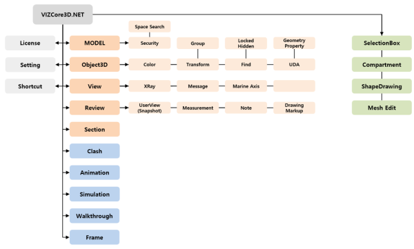

##### 데모 프로젝트 메인 화면

##### 대용량 모델 로딩 화면
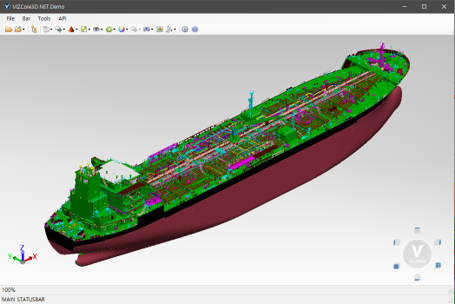

##### 렌더링 효과
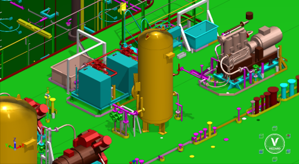

##### 모델 검색 및 Xray 모드
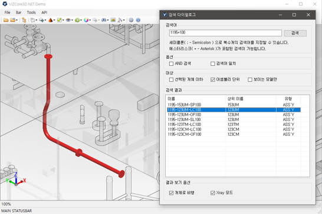

##### Geometry 속성 조회
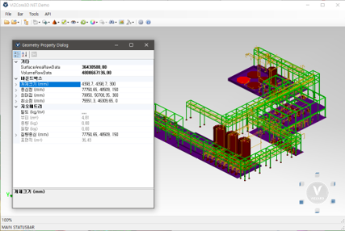

##### 보행 탐색 모드에서 아바타 활용
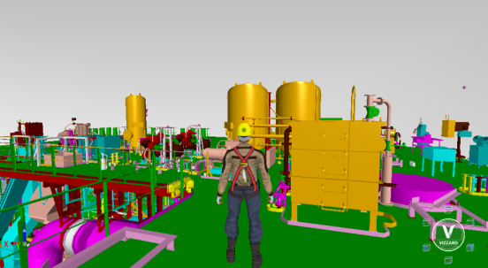

##### 모델 비교
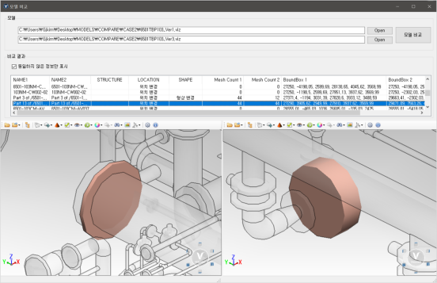

##### 모델 비교 (Youtube)

##### 공간 검색 (Youtube)

##### 선택상자 / 구획상자

##### WDL
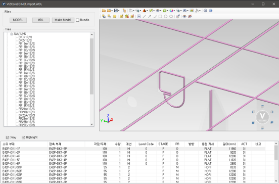

##### Mini View
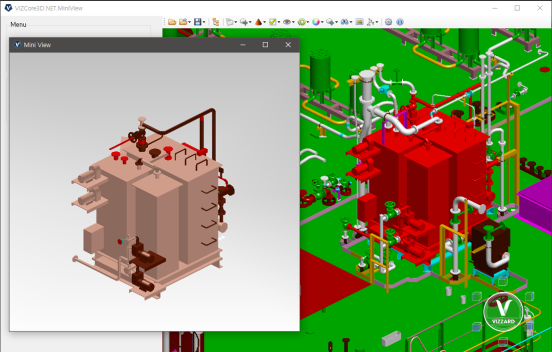

##### 3D 블록 배치 PROTOTYPE (Youtube)

##### 3D 블록 분해/조립 (Youtube)

##### 3D 탑재 시뮬레이션 By VIZZARD (Youtube)

##### 기본 설정 다이얼로그
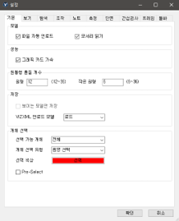

##### 로딩된 모델 정보 조회
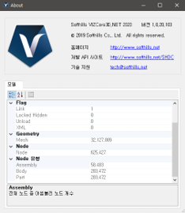
***

## 문의
### 기술지원 : tech@softhills.net
### 구매문의 : sales@softhills.net
***

## Resources

+ **Website:** [www.softhills.net](http://www.softhills.net)
+ **Product Home:** [VIZCore3D.NET](http://www.softhills.net/vizzard.html)
+ **Download:** [Download VIZCore3D.NET (Preparing...)](http://www.softhills.net/downloads/VIZCore3D.NET)
+ **Documentation:** [VIZCore3D.NET Documentation](http://www.softhills.net/SHDC)
