# VIZCore3D.NET

## 개요

대용량 3D 데이터 시각화 엔진인 VIZCore3D.NET 제품(컨트롤)에 대한 기본 사용 예제 및 활용 코드를 공유하기 위한 목적입니다.

상세 API에 대한 설명 및 예제는 SHDC (https://www.softhills.net/SHDC) 를 참고 하시기 바랍니다.
+ **Download:** [Download VIZCore3D.NET](https://www.softhills.net/SHDC/support/prod-download/)
***

## 예제 프로젝트 (WinForms)

### 기본 / 뷰어
| 구분 | 설명 | 비고 |
| --- | --- | --- |
| VIZCore3D.NET.App | 기본 뷰어 애플리케이션 | VIZCore3D.NET 기본 뷰어 |
| VIZCore3D.NET.Arguments | 명령행 인수 처리 | 명령행 인수를 통한 모델 로드 |
| VIZCore3D.NET.Demo | 주요 기능 API 활용 예제 | 개체목록, 검색, 기타 |
| VIZCore3D.NET.DemoCenter | 예제 관리 센터 | XML 기반 다양한 예제 관리 및 실행 |
| VIZCore3D.NET.Singleton | 싱글톤 패턴 구현 | 단일 인스턴스 유지 및 명령줄 인수 모델 로드 |
| VIZCore3D.NET.StreamPerfomance | 스트림 로딩 성능 측정 | 모델 스트림 로딩 성능 모니터링 |

### 모델 구조 / 속성
| 구분 | 설명 | 비고 |
| --- | --- | --- |
| VIZCore3D.NET.Structure | VIZ 파일 Structure 조회 | 파일의 Structure 및 노드별 Property 조회 |
| VIZCore3D.NET.GeometryProperty | Geometry 속성 조회 예제 | 최소점, 최대점, 중심점, 개체크기, 부피, 중량 등 정보 조회 |
| VIZCore3D.NET.UDA | UDA(User-Define Attribute) 조회 | 모델 파일에 포함된 사용자 정의 속성 정보 표시 |
| VIZCore3D.NET.UDAGrouping | UDA 기반 그룹화 | 사용자 정의 속성을 기반으로 모델 노드를 그룹화 |
| VIZCore3D.NET.MetadataDemo | 메타데이터 조회 데모 | 3D 모델의 메타데이터 조회 및 관리 |
| VIZCore3D.NET.ImportAttribute | Attribute 파일 분석 및 Import | 속성 파일을 분석하여, 모델에 API를 통해 속성을 추가 |
| VIZCore3D.NET.NodeDetail | 노드 상세 정보 조회 | 선택된 노드의 상세 정보 및 속성 표시 |
| VIZCore3D.NET.NodeCreation | 노드 생성 | 노드 생성, 대량 생성, 파일 노드 생성 등 프로그래매틱 노드 생성 |
| VIZCore3D.NET.MergeNode | 노드 병합 | 여러 노드를 병합하여 구조 단순화 |
| VIZCore3D.NET.NodeVisibleChanged | 노드 가시성 변경 이벤트 | 노드 가시성 변경 이벤트 감지 및 처리 |
| VIZCore3D.NET.MeshCount | 메시 개수 분석 | 모델의 메시 개수를 계산하고 분석 |

### 카메라 / 뷰
| 구분 | 설명 | 비고 |
| --- | --- | --- |
| VIZCore3D.NET.CameraControl | 카메라 제어 | 카메라 위치, 시점, 확대축소 제어 |
| VIZCore3D.NET.Camera.CCTV | CCTV 카메라 | CCTV 카메라 위치 설정 및 자동 회전 |
| VIZCore3D.NET.Panorama | 파노라마 뷰 | 파노라마 이미지로 3D 환경 구성 및 표시 |
| VIZCore3D.NET.UserView | 사용자 정의 뷰 | 사용자 정의 카메라 뷰 저장 및 복원 |
| VIZCore3D.NET.UserViewCustom | 사용자 정의 뷰 (파일 관리) | CVR 파일로 사용자 뷰를 별도 폴더에서 관리 |
| VIZCore3D.NET.Zoom | 줌 제어 | 특정 객체나 영역으로 카메라 줌 및 초점 제어 |
| VIZCore3D.NET.MiniView | 미니뷰 예제 | 선택 혹은 지정된 개체를 별도의 미니뷰에서 조회 |
| VIZCore3D.NET.ChildView | 자식 뷰 | 자식 뷰 관리 및 모델 표시 다이얼로그 |
| VIZCore3D.NET.MultiControl | 멀티 컨트롤 | 동일 애플리케이션 내 여러 VIZCore3D 컨트롤 동시 실행 |
| VIZCore3D.NET.MultiViewSync | 멀티 뷰 동기화 | 3개의 뷰를 동기화하여 모델 실시간 공유 |

### 검색 / 선택
| 구분 | 설명 | 비고 |
| --- | --- | --- |
| VIZCore3D.NET.Search | 모델 검색 | 모델 계층 구조에서 키워드 기반 3단계 계층적 검색 |
| VIZCore3D.NET.SpaceSearch | 모델 기반 공간 검색 | 특정 영역의 모델을 파일/노드 단위로 검색 및 조회 |
| VIZCore3D.NET.SelectionBox | 선택상자 관리 | 영역(구획) 구분, Label, Size, 영역 내 모델 검색 |
| VIZCore3D.NET.SelectionBox.V2 | 선택상자 관리 V2 | 마우스 드래그로 선택 영역을 정의하여 객체 선택 |
| VIZCore3D.NET.ShortutsAreaSelectionBox | 단축키 영역 선택 | 단축키 커스터마이즈 및 영역 선택 박스 이벤트 처리 |
| VIZCore3D.NET.NearestObjects | 최근접 객체 검색 | 클릭한 위치에서 가장 가까운 객체들을 거리 순으로 검출 |
| VIZCore3D.NET.ShortestDistance | 최단 거리 계산 | 두 객체 간의 최단거리를 계산하고 결과 표시 |

### 그룹 / 색상
| 구분 | 설명 | 비고 |
| --- | --- | --- |
| VIZCore3D.NET.Group | 개체 그룹 관리 | 선택, 검색, 속성 등을 이용하여 개체 그룹을 생성하고 조작 |
| VIZCore3D.NET.LockedHidden | 개체 숨김 기능 예제 | 항상 숨김 상태를 유지해야 하는 모델 검색 및 숨김 유지 |
| VIZCore3D.NET.Painting | 개체 색상 설정 | 색상 팔레트로 선택한 객체의 색상 설정 |
| VIZCore3D.NET.Material | 재질 관리 | 3D 모델의 재질(Material) 속성 관리 및 조회 |
| VIZCore3D.NET.GroupSilhouetteEdge | 그룹 실루엣/엣지 표시 | 객체 그룹의 실루엣 및 엣지 표시를 통한 가시성 분석 |

### 노트 / 리뷰
| 구분 | 설명 | 비고 |
| --- | --- | --- |
| VIZCore3D.NET.Note | 노트 생성 및 활용 | 2D/3D/표면노트 생성 및 활용 예제 |
| VIZCore3D.NET.Note.V2 | 노트 V2 | 3D 공간에 Surface/2D/3D 노트 추가 및 관리 |
| VIZCore3D.NET.NoteTransform | 노트 변환 | 노트의 좌표 변환(이동, 회전, 스케일) 수행 및 시각화 |
| VIZCore3D.NET.TextObject | 텍스트 객체 | 3D 공간에 텍스트 객체를 그려서 도면 및 주석 구현 |
| VIZCore3D.NET.TextObject2 | 텍스트 객체 V2 | TextObject 노트를 이동 및 회전 |
| VIZCore3D.NET.MeetingNotes | 회의 노트 | 3D 모델에 회의 노트와 주석을 추가하는 협업 도구 |
| VIZCore3D.NET.ReviewCopy | 리뷰 복제 | 리뷰 정보 복제 및 Osnap 포인트로 새 리뷰 항목 생성 |
| VIZCore3D.NET.Snapshot | 스냅샷 관리 | 3D 화면의 특정 상태를 스냅샷으로 저장 및 관리 |
| VIZCore3D.NET.WatermarkText | 워터마크 텍스트 | 3D 뷰에 워터마크 텍스트 표시 및 속성 제어 |
| VIZCore3D.NET.PMI | PMI 표시 | Product Manufacturing Information(PMI) 데이터 조회 및 표시 |

### 측정 / 단면
| 구분 | 설명 | 비고 |
| --- | --- | --- |
| VIZCore3D.NET.MeasureFrame | 프레임 기반 거리 측정 | 프레임(좌표계) 기반의 거리 측정 |
| VIZCore3D.NET.SectionAutoClip | 자동 단면 생성 | 선택된 객체의 경계 상자 기반 자동 단면 상자 생성 |
| VIZCore3D.NET.SectionBoxAlign | 단면 상자 정렬 | 단면 상자 위치를 프레임 좌표에 정렬 |
| VIZCore3D.NET.SectionBoxSize | 단면 상자 크기 조정 | 단면 상자의 좌표값을 프레임 그리드 항목으로 조정 |
| VIZCore3D.NET.SectionClippedEdge | 단면 절단면 엣지 | 단면 절단면 모서리 정보를 2D 그래픽으로 렌더링 |
| VIZCore3D.NET.SectionVolume | 단면 부피 계산 | 단면 상자로 절단된 모델의 부피 계산 및 결과 표시 |

### 간섭 검사 / 충돌
| 구분 | 설명 | 비고 |
| --- | --- | --- |
| VIZCore3D.NET.ClashTest | 간섭검사 | 장비, 모델, 그룹, 이동(탑재) 검사 수행 및 결과 조회 |
| VIZCore3D.NET.ClashTest.V2 | 간섭검사 V2 | 두 객체 그룹 간의 간섭검사 수행 |
| VIZCore3D.NET.ClashTest.V3 | 간섭검사 V3 | 블록 기반 간섭검사 및 결과 시각화 |
| VIZCore3D.NET.ClashTest.V4 | 간섭검사 V4 | XML 기반 간섭검사 결과 관리 |
| VIZCore3D.NET.AnimationClashTest | 애니메이션 간섭검사 | 애니메이션 재생 중 간섭검사 수행 |
| VIZCore3D.NET.ObjectCollisionLineSegments | 충돌 라인 세그먼트 | 선택된 객체들 간 충돌 라인 세그먼트 계산 및 표시 |

### 모델 비교 / 분석
| 구분 | 설명 | 비고 |
| --- | --- | --- |
| VIZCore3D.NET.ModelComparison | 모델 비교 | 2개의 모델파일을 비교(구조, 위치, 형상)하여 차이점 조회 |
| VIZCore3D.NET.ModelComparisonSingleMode | 모델 비교 (단일 뷰) | 단일 뷰어에서 원본/대상 모델을 색상으로 구분하여 비교 |
| VIZCore3D.NET.AnalysisModel | 모델 분석 | 디자인 모델과 분석 모델 비교 및 분석 |
| VIZCore3D.NET.VisualInspection | 시각적 검사 | 3D 모델의 시각적 검사 및 품질 확인 |
| VIZCore3D.NET.ImageAnalysis | 이미지 분석 | 3D 모델에 대한 이미지 기반 분석 |

### 애니메이션 / 시뮬레이션
| 구분 | 설명 | 비고 |
| --- | --- | --- |
| VIZCore3D.NET.Animation.Block | 블록 애니메이션 | 블록 기반 애니메이션 생성 및 재생 |
| VIZCore3D.NET.Animation.Objects | 객체 애니메이션 | 개별 객체의 이동 및 회전 애니메이션 |
| VIZCore3D.NET.Animation.V2 | 애니메이션 V2 | 블록 데이터 기반 향상된 애니메이션 시스템 |
| VIZCore3D.NET.Simulation | 시뮬레이션 | 경로 이동 간섭검사 시뮬레이션 및 충돌 결과 애니메이션 |
| VIZCore3D.NET.Erection.V1 | 건설 단계 시뮬레이션 | 애니메이션 키를 이용한 건설 단계별 모델 조립 과정 재현 |
| VIZCore3D.NET.Disassembly | 분해 애니메이션 | 어셈블리 분해 및 부품 이동 애니메이션 |
| VIZCore3D.NET.AvatarPath | 아바타 경로 이동 | 아바타 경로 이동 시 충돌 감지 및 표시 |

### 도크 / 선박
| 구분 | 설명 | 비고 |
| --- | --- | --- |
| VIZCore3D.NET.DockBuild | 도크 구축 | 그리드 생성, 공간 검사, 지지점 미리보기, 단면 분석 |
| VIZCore3D.NET.DockInOut | 도크 입출항 시뮬레이션 | 배 모델의 도크 입출항 시 지지점 및 충돌 검사 |
| VIZCore3D.NET.DockOut | 도크 출항 검증 | 도크에서 배 출항 시 충돌 검사 및 격자 공간 관리 |
| VIZCore3D.NET.BayBlock | 베이 블록 배치 | 베이 구역 내 블록 배치 및 이동 |
| VIZCore3D.NET.BayBlockRotation | 베이 블록 회전 | 베이 내 블록의 회전 및 배치 |
| VIZCore3D.NET.BayCreate | 베이 영역 생성 | 선체 분할 베이 영역 생성 |
| VIZCore3D.NET.AssembleHull | 선체 조립 | 선체 조립 처리 및 기하학적 생성 |
| VIZCore3D.NET.TOB | 블록 적재 시뮬레이션 | 선박 블록 적재 시뮬레이션 (롤러, 러그, 변환 경로 포함) |
| VIZCore3D.NET.LoadingSpace | 로딩 공간 | 로딩 공간 계산 및 이동 경로 애니메이션 표시 |
| VIZCore3D.NET.PlacementStatus | 배치 상태 관리 | 여러 모델의 배치 상태(위치, 회전) 관리 및 검증 |
| VIZCore3D.NET.UnfoldBlock | 블록 전개도 | 3D 블록 모델을 전개도로 펼쳐서 2D 평면 구조 표현 |
| VIZCore3D.NET.SimplifyBlockByPart | 블록 부품 단순화 | 블록 부품을 단순화하여 모델 복잡도 감소 |

### 변환 / 회전 / 이동
| 구분 | 설명 | 비고 |
| --- | --- | --- |
| VIZCore3D.NET.RotateModel | 모델 회전 | 카메라 기반 매트릭스 계산으로 모델 회전 |
| VIZCore3D.NET.RotateModel.V2 | 모델 회전 V2 | 슬라이더로 X/Y/Z 축 방향 모델 회전 및 변환 관리 |
| VIZCore3D.NET.RotateMatrix | 회전 행렬 계산 | 회전 행렬 계산 및 3D 모델 변환 매트릭스 표시 |
| VIZCore3D.NET.CustomAxisRotation | 사용자 정의 축 회전 | 사용자 정의 축을 기준으로 객체 회전 |
| VIZCore3D.NET.MoveWithMouse | 마우스 드래그 이동 | 마우스 드래그로 객체 이동 및 경로 화살표 시각화 |
| VIZCore3D.NET.ObjectScale | 객체 스케일 변경 | 3D 객체의 스케일 변경 |

### 메시 / 형상 편집
| 구분 | 설명 | 비고 |
| --- | --- | --- |
| VIZCore3D.NET.MeshEdit | 메시 편집 | 메시 병합, 꼭짓점/선/면 이동, 단순화, 면 자르기 등 |
| VIZCore3D.NET.MeshEdit.V2 | 메시 편집 V2 | 메시 편집 기능 개선 버전 |
| VIZCore3D.NET.ShapeDrawing | 3D Shape 그리기 | Line, Cube, Cylinder, Vertex 유형을 화면에 추가 및 관리 |
| VIZCore3D.NET.CircleGeo | 원형 기하학 객체 | 원형 기하학적 객체 생성 및 조작 |
| VIZCore3D.NET.ConnectedSurface | 연결된 표면 | 연결된 표면 생성 및 기하학적 처리 |
| VIZCore3D.NET.ReplacePrimitive | 기본 도형 교체 | 기본 도형(Primitive) 생성 및 다른 도형으로 교체 |
| VIZCore3D.NET.JunctionMesh | 메시 접합 | 두 메시의 접합점을 입력받아 처리 |
| VIZCore3D.NET.SurfaceNormal | 표면 법선 벡터 | 3D 모델 표면의 법선 벡터 계산 및 표시 |
| VIZCore3D.NET.SymbolObjects | 심볼 객체 | 심볼 리소스를 생성/로드하여 3D 모델에 심볼 객체 추가 |
| VIZCore3D.NET.ZoneObjects | 존 객체 관리 | 3D 공간을 영역으로 구분하고 관리 |

### 투영 / 2D
| 구분 | 설명 | 비고 |
| --- | --- | --- |
| VIZCore3D.NET.Projection2D | 3D 모델 외곽형상 추출 | 외곽라인 정보 및 PathGeometry를 활용한 가시화 |
| VIZCore3D.NET.Projection2D.DrawControl | 2D 투영 드로우 컨트롤 | 2D 경로 기하학 기반 도형을 그리는 WPF 컨트롤 |
| VIZCore3D.NET.ProjectionArea | 투영 영역 계산 | XY/YZ/ZX 평면 및 현재 카메라 뷰 투영 영역 계산 |
| VIZCore3D.NET.ProjectionGrid | 투영 그리드 | 투영 기반 그리드 패널과 3D 뷰 연동 좌표계 관리 |

### 이미지 / 썸네일
| 구분 | 설명 | 비고 |
| --- | --- | --- |
| VIZCore3D.NET.CaptureImage | 이미지 캡처 | 3D 화면 이미지 캡처 및 저장 |
| VIZCore3D.NET.Capture3D | 3D 캡처 | 3D 모델을 미니뷰와 함께 캡처 |
| VIZCore3D.NET.GenerateThumbnail | 미리보기 이미지 생성 | 선택한 모델 파일의 미리보기 이미지 생성 및 조회 |
| VIZCore3D.NET.Thumbnail | VIZ 파일 Thumbnail 조회 | 파일의 Thumbnail 및 BoundBox 정보 조회 |
| VIZCore3D.NET.StructureThumbnail | 노드별 미리보기 조회 | VIZ 파일의 각 노드별 미리보기 이미지 생성 및 결과 조회 |
| VIZCore3D.NET.NodeThumbnail | 노드 썸네일 | 각 노드별 썸네일 이미지를 동적으로 생성 및 표시 |

### 내보내기 / 변환
| 구분 | 설명 | 비고 |
| --- | --- | --- |
| VIZCore3D.NET.ToVIZ | VIZ 파일로 내보내기 | 모델 원본을 VIZ 파일 형식으로 저장 |
| VIZCore3D.NET.ExportNode | 모델 내보내기 | 특정 노드 혹은 전체 노드 단위로 내보내기 |
| VIZCore3D.NET.ExportGrid | 그리드 영역 내보내기 | 단면 박스를 이용한 그리드 영역 내 모델 내보내기 |
| VIZCore3D.NET.EncryptDecrypt | 암호화/복호화 | VIZ 파일의 암호화/복호화 및 비밀번호 보호 파일 열기 |
| VIZCore3D.NET.GenFile | GEN 파일 처리 | 마킹, 텍스트, 문자열 등의 생성 파일(GEN) 데이터 처리 |
| VIZCore3D.NET.GenFile.V2 | GEN 파일 처리 V2 | 베벨 심볼, 마킹, 문자열 및 깊이 테스트 기능 포함 |

### 프레임 / 그리드 / 좌표
| 구분 | 설명 | 비고 |
| --- | --- | --- |
| VIZCore3D.NET.FramePrefix | 프레임 접두어 설정 | 프레임(좌표계) 기반 객체에 ID 또는 위치 접두어 설정 |
| VIZCore3D.NET.GridThreeD | 3D 그리드 분석 | 4개의 3D 뷰어로 메인, 분해, 그리드, 뷰 모드 동시 표시 |
| VIZCore3D.NET.GridThreeD.V2 | 3D 그리드 분석 V2 | 블록 회전 및 그리드 기반 공간 분석 개선 버전 |
| VIZCore3D.NET.ReferenceAxis | 참조 좌표계 관리 | 참조 좌표계(Reference Axis) 생성, 활성화, 변환 및 관리 |

### 입력 / 인터페이스
| 구분 | 설명 | 비고 |
| --- | --- | --- |
| VIZCore3D.NET.Import.WDL | WELD 정보 불러오기 | WELD LINE 정보 조회 및 가시화 |
| VIZCore3D.NET.Joypad | 조이패드 제어 | 게임 컨트롤러(조이패드)를 이용한 3D 모델 네비게이션 |
| VIZCore3D.NET.MouseIdleDetector | 마우스 비활성 감지 | 마우스 비활성 시간 감지 및 라이선스 서버 자동 연결 해제 |
| VIZCore3D.NET.Osnap | Osnap (객체 스냅) | 객체의 스냅 포인트 감지 및 표시 |
| VIZCore3D.NET.Osnap2DPoint | Osnap 2D 좌표 변환 | Osnap 피킹 포인트를 화면 2D 좌표로 변환하여 표시 |
| VIZCore3D.NET.WebBrowserInterworking | 웹 브라우저 연동 | 웹 브라우저와 VIZCore3D 간 JavaScript 양방향 통신 |
| VIZCore3D.NET.SomeLookup | 모델 조회 (듀얼 뷰) | 주 화면과 상세 뷰 두 개의 컨트롤을 이용한 모델 조회 |

### 기타
| 구분 | 설명 | 비고 |
| --- | --- | --- |
| Gallery | 스크린샷 | 주요 기능 화면 |
***

## 제품 비교

| Features  | Standard | Manager | Comments |
| ------------- | :---: | :---: | ------------- |
| Direct read of 3D (REV, RVM, RVT) | O | O | |
| Viewing | O | O | |
| Navigation | O | O | |
| Product Structure | O | O | |
| Properties viewings | O | O | |
| Transformation | O | O | |
| Object color change | O | O | |
| (Review) Note | O | O | |
| (Review) Measurement | O | O | |
| (Review) Cross section | O | O | |
| (Review) Snapshot | O | O | |
| Export Image | O | O | |
| Export VIZ | O | O | |
| Export VIZXML | O | O | |
| Export VIZM | X | O | |
| Export VIZW | X | O | |
| Export STL | X | O | |
| Export OBJ | X | O | |
| Export reviews | O | O | |
| Advanced navigation (walk, fly) | X | O | |
| Interference Check | X | O | |
| Animation | X | O | |
| Simulation | X | O | |
| Frame (Ship grid) | X | O | |

***
## Gallery
##### COMPONENT DIAGRAM
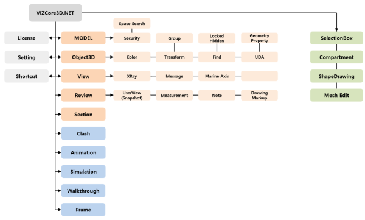

##### 데모 프로젝트 메인 화면
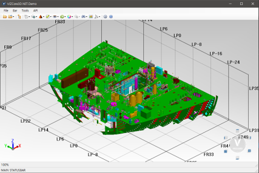

##### 대용량 모델 로딩 화면
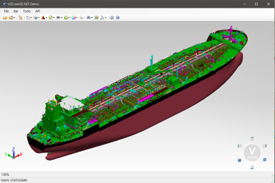

##### 렌더링 효과
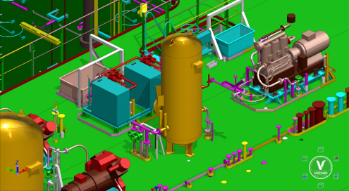

##### 모델 검색 및 Xray 모드
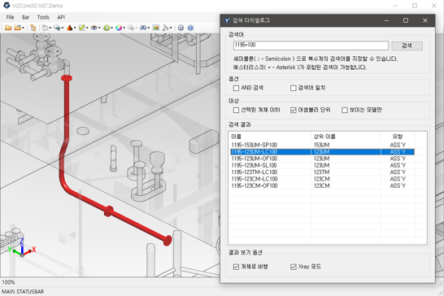

##### Geometry 속성 조회
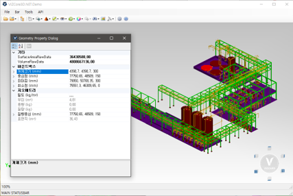

##### 보행 탐색 모드에서 아바타 활용
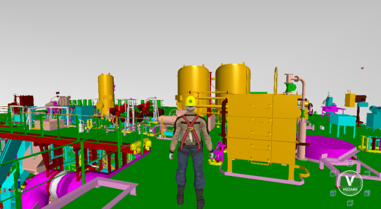

##### 모델 비교
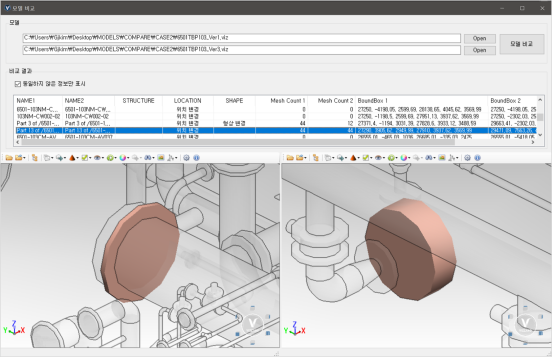

##### 모델 비교 (Youtube)

##### 공간 검색 (Youtube)

##### 선택상자 / 구획상자
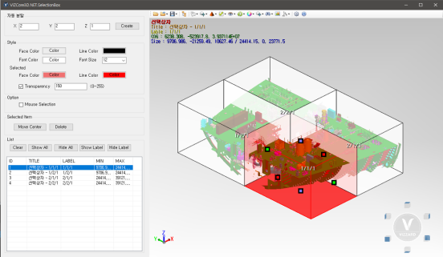

##### 선택상자 / 구획상자 (Youtube)

##### 선택상자 / 구획상자 (Youtube)

##### WDL
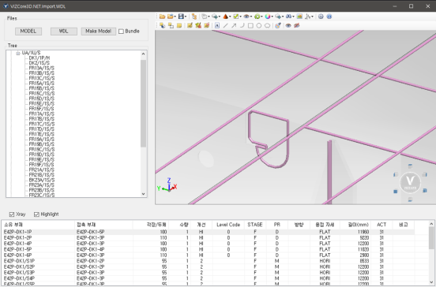

##### Mini View
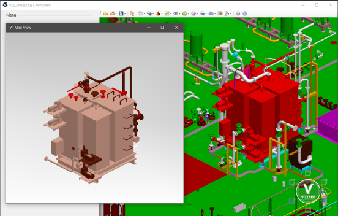

##### 3D 블록 배치 PROTOTYPE (Youtube)

##### 3D 블록 분해/조립 (Youtube)

##### 3D 탑재 시뮬레이션 By VIZZARD (Youtube)

##### 2D Projection(투영) (Youtube)

##### Avatar Path (Youtube)

##### PMI (Product Manufacturing Information) (Youtube)

##### Block Mounting Animation (Youtube)

##### CCTV Camera (Youtube)

##### DOCK BUILD (Youtube)

##### 기본 설정 다이얼로그
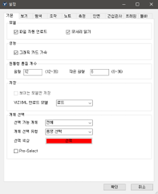

##### 로딩된 모델 정보 조회
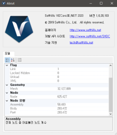
***

## 문의
### 기술지원 : tech@softhills.net
### 구매문의 : sales@softhills.net
***

## Resources

+ **Website:** [www.softhills.net](https://www.softhills.net)
+ **Product Home:** [VIZCore3D.NET](https://www.softhills.net/vizzard.html)
+ **Download:** [Download VIZCore3D.NET](https://www.softhills.net/SHDC/support/prod-download/)
+ **Documentation:** [VIZCore3D.NET Documentation](https://www.softhills.net/SHDC)
